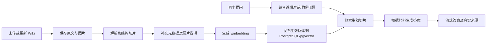

# lishouAgent 迁移与开发计划

> 本文件是项目需求、技术决策、开发任务和进度记录的统一入口。后续每次开发均需先阅读本文件，并在结束、交接或产生重要进展时同步更新对应任务、验收结果和进度日志。

- 创建日期：2026-10-04
- 最近更新：2026-10-04
- 时间基准：Asia/Shanghai（北京时间）
- 当前阶段：M0 本地迁移基线已完成；GitHub 推送待完成
- 源项目：`D:\Coding\Java-learn\brownie-ai-agent`
- 目标项目：`D:\Coding\Java-learn\lishouAgent`
- 目标仓库：`https://github.com/brownieya/lishouAgent.git`
- 新项目包名：`com.brownie.lishouagent`；数据库：`lishou_agent`；后端端口：`8124`
- 首批知识资料：`D:\Coding\Java-learn\brownie-ai-agent\lishou-private-data-含图片`

## 1. 项目目标与已确定范围

lishouAgent 是面向公司同事的内部 Wiki 知识助手，用于了解公司项目、系统用途、项目关系、业务流程、操作方法和技术文档。回答需要有可核实的文档来源；资料不足时明确说明，不编造公司事实。

已确定的使用条件：

1. 公司约十多人，知识文档全员可查看、编写；第一版采用一个共享知识库。
2. Wiki 可导出文件，第一版采用手动上传和更新，不依赖在线 Wiki 平台连接器。
3. 首批资料已检查：10 篇 Markdown、4 张 PNG、1 张 JPG；10 篇均有正文；5 处图片引用均能找到本地文件。导出目录本身不证明覆盖了全部业务或所有资料均为最新。
4. PostgreSQL 同时保存普通业务数据与向量数据；使用 pgvector 扩展进行知识检索。
5. 完整会话和消息持久化到数据库；知识全员共享，个人聊天按用户隔离。
6. 第一版包含聊天页面、历史会话、知识库管理页面、文档上传切片、切片编辑与重新索引、回答引用、图片资料保留、增量更新和 Docker Compose 部署。
7. Thinking 是可选增强能力，不是开启 RAG 或 ReAct 的前提，也不阻塞核心第一版验收。

### 1.1 第一版必须交付

- 有来源的 Wiki 问答和多轮追问。
- 新建、切换、重命名、删除会话；刷新后恢复历史消息。
- 文档列表、分类、原文预览、切片列表、处理状态和错误信息。
- Markdown 与包含 Markdown/图片目录的 ZIP 导入；保留原目录关联和图片引用。
- 切片编辑、删除或停用，保存后重新向量化；失败时保留旧生效版本。
- 文档去重、版本更新、删除与关联向量清理。
- 当前 5 张图片的关键内容文字化，并能查看原图。
- 基础用户身份、会话归属校验、编辑者和上传者记录。
- 数据库及原文件持久化、备份恢复说明、真实业务问题验收。

### 1.2 后续增强

- Thinking 开关、思考事件展示及 Token/延迟记录。
- HTML、PDF 导入，OCR 或视觉模型辅助理解图片。
- 切片合并、拆分、批量编辑、版本回退。
- 项目简称/别名词典、关键词与向量混合检索、重排序。
- 自动同步 Wiki、用户反馈统计、跨系统只读查询工具。

第一版不要求多智能体、复杂部门权限、自动办事、任意终端执行、外网搜索、Redis、消息队列、Kubernetes 或模型微调。

## 2. 当前项目基线

以下结论来自本地代码检查，不代表已查询生产数据库或已通过端到端运行验证。

| 模块 | 当前状态 | 迁移影响 |
| --- | --- | --- |
| 后端 | Java 21、Spring Boot 3.5.16 | 保留基础框架，新增公司知识业务 |
| AI 接入 | Spring AI Alibaba 1.1.2.0；部分 Spring AI 组件为 1.1.2；DashScope | 新增依赖与现有兼容版本对齐，不顺带升级主版本 |
| LoveApp | 恋爱角色、基础聊天、流式聊天、会话记忆 | 改造成公司知识助手服务 |
| RAG | 已有文档加载、查询改写、检索增强；当前 RAG 方法未接入页面聊天，并固定“单身”过滤 | 必须重新接通 RAG 流式链路，去掉恋爱过滤 |
| 向量库 | 同时存在内存 SimpleVectorStore、PostgreSQL pgvector、百炼云知识库配置 | 第一版统一为 PostgreSQL＋pgvector，移除重复方案及强制注入 |
| 文档来源 | `classpath:document/*.md` 下的恋爱文档 | 改为可配置的外部文件存储与用户触发的导入服务 |
| pgvector 入库 | Bean 初始化时加载全部文档并 add | 应用启动不再重新导入所有文档 |
| 恋爱会话记忆 | 当前启用本地 `.kryo` 文件，内存实现已注释；使用有限消息窗口 | 改为数据库历史记录与模型上下文管理 |
| 前端 | Vue 3＋Vite；首页、LoveApp、Manus；真实 SSE 调用 | 保留聊天组件，新增会话侧栏和知识管理界面 |
| 前端会话 | 页面内存保存消息；每次进入生成新 chatId | 接入后端会话记录，恢复已有会话 ID |
| Manus | ReAct 式工具循环和 Step 输出 | 第一版移除相关业务入口和工具依赖 |
| Thinking | 尚未显式启用，也未单独传输 reasoning 字段 | 增强阶段按请求参数实现 |
| 部署 | 已有后端 Dockerfile 和生产配置 | 补充前端镜像、pgvector 数据库、Compose、卷与备份 |

## 3. 迁移清单

### 3.1 保留并改造

| 内容 | 迁移方式 |
| --- | --- |
| Maven、Java 21、Spring Boot | 保留构建能力，改项目标识、包结构和配置示例 |
| DashScope ChatModel、ChatClient | 保留模型接入；区分聊天模型、Embedding 模型和配置 |
| LoveApp 基础对话 | 迁移为公司知识服务，建议命名 `LishouAssistantService` |
| MessageChatMemoryAdvisor 的上下文能力 | 与数据库会话读取结合；不将有限窗口作为完整聊天历史 |
| RAG 文档处理、查询改写、检索组件 | 改造标题/步骤切片、项目元数据和多轮检索 |
| PostgreSQL JDBC 和 pgvector | 保留，使用单一数据源管理业务表与向量表 |
| Vue 聊天组件、路由、输入、滚动与流式显示 | 改成 lishouAgent 页面并接入新的事件协议 |
| 健康检查、日志、错误处理、测试基础 | 保留有用部分，调整公司知识场景与日志内容 |
| Dockerfile 和生产环境配置思路 | 改为新项目名称、环境变量和多容器部署 |

### 3.2 删除或不迁入第一版

- 恋爱系统提示词、恋爱示例知识文档、LoveReport 和恋爱场景测试。
- 内存向量库与百炼云知识库作为默认依赖的配置。
- Manus 页面、业务 Controller 入口、ReAct 工具注册及第一版不用的 Agent 类。
- 任意终端执行、文件读写工具、外网搜索、网页抓取、资源下载、PDF 生成、任务终止工具。
- 图片搜索 MCP 子项目、MCP 默认依赖与闲置配置。
- 与最终产品无关的模型调用演示、旧项目笔记和示例测试。
- 前端双应用选择入口；改为聊天和知识库管理的导航。

工具代码如需保留学习参考，继续保留在原项目，避免新服务因未使用的 Bean、密钥或外部服务而启动失败。

### 3.3 迁移操作约定

1. 保留原项目，迁移开发在目标目录独立进行。
2. 基于当前源代码内容迁移；源项目存在的未提交改动先核对，避免只复制 Git HEAD 而漏掉有效配置，也不修改或重置原项目。
3. 不复制旧 `.git`、`target`、`node_modules`、`dist`、临时生成文件、聊天记忆文件及真实密钥。
4. 创建独立 Git 仓库，编写 README、配置模板和忽略规则；内部 Wiki 原文、图片及含内部资料的压缩包不提交到代码仓库。
5. 迁移后验证依赖、包名、入口类、接口路径、前端 API 地址和镜像名称均已更新。
6. 为后续自动维护进度，在目标项目建立 `AGENTS.md`，要求开发前阅读本计划、结束前更新本计划。

## 4. 功能设计与验收要求

### 4.1 共享知识问答

- 查询项目用途、项目关系、业务流程、操作步骤和接口说明。
- 允许选择项目分类缩小检索范围，默认检索共享知识库。
- 用户追问时，用近期上下文补全“这个项目”“第二步”等检索条件；保留原问题用于生成回答。
- 查询改写不应改变项目名称、接口名和公司专有术语。
- 回答依据检索资料；找不到时说明资料不足，问题有歧义时追问。
- 文档冲突时展示差异、来源和已知版本时间，不自行确定未记载的公司规定。

验收：使用真实问题验证检索到了正确文档，回答包含准确步骤与真实引用；无资料、歧义、多轮追问和冲突场景均有合理表现。

### 4.2 会话与用户

- 基础登录；所有用户具有相同的共享知识维护能力。
- 每个会话归属于一个用户，后端校验查询、发送、重命名和删除操作的归属。
- 会话列表、消息分页、刷新恢复、新建与删除。
- 持久化完整用户消息和 AI 答案，记录生成中、完成、失败或中断等状态。
- 模型上下文按窗口或 Token 预算选取；窗口裁剪不删除完整历史消息。
- 保存答案引用快照，后续文档更新或删除时仍能说明当时引用的来源。

验收：两名用户可以同时使用，不能读取对方聊天；重启后会话可恢复；长会话仍保留历史，但模型输入有可控大小。

### 4.3 文档上传与处理

- 第一版支持 Markdown 和含 Markdown/图片目录的 ZIP；可批量导入。
- 保留文档与图片相对路径；存储使用稳定 ID，避免同名覆盖。
- 可填写项目分类、文档标题和原始 Wiki 链接；没有 Wiki 链接时使用导入文件预览。
- 校验文件类型、大小和 ZIP 路径，防止解压目录越界。
- 导入采用后台任务，页面可查询解析、切片、向量化、完成、失败等状态和进度。
- 原文件、图片和解析后的结果分别可追溯；导入失败可重试。
- 进程重启后识别未完成任务，标记为中断并允许重试，不显示虚假的完成状态。

验收：现有资料可完整导入，图片关联不丢失；错误文件有明确提示；重复导入不会产生重复生效切片。

### 4.4 切片规则与切片管理

- 按标题层级、主题和完整业务步骤组织切片；必要时使用长度上限和重叠策略。
- 避免将一个完整操作步骤、表格或代码示例切断；切片携带项目名和章节上下文。
- 切片大小、重叠和检索参数配置化，通过真实问题调试，不沿用恋爱库参数作为结论。
- 管理页面展示切片列表、所属文档、章节、正文、原始内容、人工编辑标记和状态。
- 支持编辑、删除或停用；编辑者与修改时间可查。
- 编辑使用版本检查，避免多人同时编辑时无提示覆盖。
- 编辑产生新版本并重新计算向量；新版本成功索引后生效，失败时旧版本继续用于检索。
- 文本、向量和生效版本需一致；Embedding 调用与正式发布分别处理，不允许“新正文＋旧向量”。

验收：编辑后使用相关问题检索，命中新版内容；Embedding 失败时旧版仍可用；停用或删除的切片不再命中。

### 4.5 文档版本、去重和删除

- 以稳定文档 ID、内容哈希和版本记录识别未变化、更新或重复内容。
- 更新文档时先处理新版本，成功后统一切换生效版本，避免新旧切片混用。
- 人工修改与原始 Wiki 内容分别保留；重新导入发生冲突时提示处理，不静默覆盖。
- 删除文档同步停用或清理有效切片、向量和相关检索数据。
- 原始资料更新是业务事实变更的来源；人工切片编辑用于整理上下文，不暗示原 Wiki 已修改。

验收：同一文档重复导入后只有一套生效内容；更新失败保留旧版；删除后无法检索到该文档。

### 4.6 来源与图片

- 答案引用来自真实检索记录，不能由模型自由生成文档链接。
- 展示文档标题、章节、来源地址、版本或已知更新时间；时间未知时不伪造 Wiki 更新时间。
- 可查看相关原文和图片；人工整理的片段显示修改信息。
- 为现有 5 张图片逐张判断用途；关键流程图、截图人工补充文字说明，并与原文、图片 ID 关联后参与文本检索。
- 原图保留供同事核对；展示图片与理解图片是两个独立能力。

验收：引用可打开对应材料；涉及图片的信息能通过说明检索；没有文字化的图片内容不声称已覆盖。

### 4.7 可选 Thinking 增强

- 选择支持 Thinking 的模型版本，按请求传递 `thinking` 开关。
- 当前 Spring AI Alibaba 1.1.2.0 支持 `DashScopeChatOptions.builder().enableThinking(...)`，可选 `thinkingBudget(...)`。
- 使用 `.stream().chatResponse()`，思考内容读取 AssistantMessage metadata 的 `reasoningContent`，最终答案读取 `getText()`。
- 通过独立事件展示供应商允许展示的思考内容或摘要；普通回答区域与思考区域分别处理。
- 记录 Token 消耗、延迟和中断情况，设置可配置的预算和超时。
- Thinking 与 ReAct 区分：开启模型推理不要求恢复原项目 Manus 工具循环。

验收：开关实际传到模型请求；前端事件分流正确；所选模型的支持范围经过真实调用验证。

## 5. 技术方案

### 5.1 推荐技术栈

| 用途 | 技术 | 状态/说明 |
| --- | --- | --- |
| 后端 | Java 21＋Spring Boot | 复用当前兼容版本 |
| 模型与 RAG | Spring AI Alibaba、ChatClient、DashScope、检索增强组件 | 复用，重建公司知识链路 |
| 数据库 | PostgreSQL＋pgvector | 一套数据库，业务表与向量表分工 |
| 数据访问 | 现有 JdbcTemplate；Flyway 管理结构迁移 | 新增业务存取和迁移脚本 |
| 模型上下文 | 自定义历史读取/窗口；可辅以 JDBC ChatMemory | 不与完整消息存档混淆 |
| 文档处理 | MarkdownDocumentReader＋自定义结构切片 | 第一版先支持实际资料格式 |
| 前端 | Vue 3＋Vite＋Vue Router＋现有组件 | 新增知识库管理和会话侧栏 |
| 页面预览 | Markdown 解析、HTML 净化和安全图片地址 | 新增；库版本在实际选型时记录 |
| HTTP | Axios 处理普通接口；fetch 消费 POST SSE | 将对话内容放请求体，支持取消请求 |
| 登录 | Spring Security 或公司已有身份入口 | 默认简单账号方案，不建设复杂角色权限 |
| 后台任务 | Spring 线程池＋PostgreSQL 任务记录 | 第一版无需消息队列 |
| 文件存储 | 配置化服务器目录/持久化卷 | 保存原文和图片；数据库保存关联 |
| 部署 | Docker Compose＋Nginx＋后端＋pgvector 数据库 | 服务各用独立容器 |

新增依赖的版本必须与当前 Spring Boot / Spring AI 组合兼容。升级主版本如确有必要，需要在本计划记录原因、影响和验证结果。

### 5.2 两条处理链路



### 5.3 业务数据设计

下表是逻辑实体，实际建表时根据接口与查询需求确定字段、索引和约束，并通过 Flyway 管理。

| 实体/建议表名 | 主要内容 |
| --- | --- |
| `app_user` | 用户身份、凭据摘要或外部身份、状态 |
| `chat_session` | 用户、标题、创建/更新时间、状态 |
| `chat_message` | 会话、角色、正文、顺序、时间、生成状态 |
| `chat_message_source` | 回答引用的文档/章节/版本快照 |
| `knowledge_document` | 稳定文档 ID、标题、项目、来源、当前生效版本 |
| `knowledge_document_version` | 文件位置、内容哈希、版本、解析与发布时间 |
| `knowledge_asset` | 图片 ID、所属文档版本、文件位置、说明 |
| `knowledge_chunk` | 稳定切片标识、所属文档/章节、当前生效修订、启用状态 |
| `knowledge_chunk_revision` | 原始/人工内容、修订号、修改者、状态及索引信息 |
| `vector_store` | 对应生效切片修订的正文、metadata、embedding |
| `ingest_task` | 文档导入或重新索引任务、阶段、进度、错误及重试信息 |

向量记录通过 ID 或 metadata 关联切片修订，保留文档、项目、标题、章节、来源、版本等元数据。检索只使用启用且生效的内容。Embedding 模型或维度变更时需要重新索引，不能直接混用不同模型生成的向量。

### 5.4 接口与流式协议

基础接口分组：

- 身份：登录、退出、当前用户。
- 会话：列表、新建、重命名、删除、分页读取消息。
- 问答：向某个会话发送消息，通过 POST SSE 返回结果。
- 文档：分页列表、详情、原文预览、上传、重新导入、版本与删除。
- 切片：按文档查询、详情、编辑并重新索引、停用/启用、删除。
- 图片：查看原图、查看或编辑文字说明。
- 任务：状态、进度、错误、失败重试。

SSE 至少区分 `answer`、`sources`、`done`、`error`，可选 `status` 和 `thinking`。约定统一数据格式、结束信号和错误语义；前端不能把断线自动当作成功，完成或失败后关闭连接。

### 5.5 部署与持久化

- 一台服务器运行 Nginx、Spring Boot 和 PostgreSQL＋pgvector 三个容器，使用 Docker Compose 管理。
- 后端通过 Compose 服务名连接数据库，不使用后端容器自己的 localhost。
- PostgreSQL 数据目录、原始 Wiki 和图片目录挂载持久化卷或明确的主机目录。
- 密钥、数据库连接信息和初始化账号配置放环境变量或部署配置，不进入源代码或镜像。
- 前端、后端、模型请求和长时间 SSE 的超时配置相互匹配。
- 提供数据库与原始资料的备份/恢复步骤，至少执行一次恢复验证。
- 持久化卷保证容器重建后保留数据，不能代替备份；数据库大版本升级单独制定迁移步骤。

## 6. 完整开发计划

任务状态统一使用：`待开始`、`进行中`、`待验证`、`已完成`、`阻塞`、`延期`。只有验收通过才能标记为已完成。阶段状态与任务状态必须保持一致。

### M0：代码迁移与工程整理

依赖：无。当前状态：已完成。

| 任务 ID | 工作内容 | 状态 |
| --- | --- | --- |
| M0-01 | 核对源项目改动、创建独立仓库、复制需要的源码与配置模板 | 已完成 |
| M0-02 | 更新项目名、包名、入口类、接口路径及前端标识 | 已完成 |
| M0-03 | 清理恋爱业务、Manus、闲置工具、MCP 和重复向量库依赖 | 已完成 |
| M0-04 | 编写 README、忽略规则、配置示例和引用本计划的 AGENTS.md | 已完成 |
| M0-05 | 验证后端编译/基础启动与前端构建，记录环境和结果 | 已完成 |

交付：能独立构建的 lishouAgent 工程，不依赖原项目临时文件和学习服务。

验收：原项目改动保持原样；目标项目包名和配置一致；真实密钥和内部资料只迁入忽略的本地目录、不进入 Git 或镜像；构建结果有记录。无真实模型/数据库的编译与单元测试不等于端到端验收。

### M1：数据库、身份与持久化基础

依赖：M0。当前状态：待开始。

| 任务 ID | 工作内容 | 状态 |
| --- | --- | --- |
| M1-01 | 确定核心字段、关系、索引和状态，创建 Flyway 脚本 | 待验证 |
| M1-02 | 配置 PostgreSQL＋pgvector，验证扩展及 Embedding 维度 | 待开始 |
| M1-03 | 实现基础身份入口、初始化方式与会话归属校验 | 待开始 |
| M1-04 | 实现会话/消息存取接口与完整消息持久化 | 待开始 |
| M1-05 | 建立配置化文件存储、任务记录和后台执行基础 | 待开始 |

交付：业务数据层、身份层和后台任务基础。

验收：数据库重启后数据存在；两用户会话隔离；迁移脚本可用于空库初始化。

### M2：Wiki 导入、图片关联与自动切片

依赖：M1。当前状态：待开始。

| 任务 ID | 工作内容 | 状态 |
| --- | --- | --- |
| M2-01 | 实现 Markdown/ZIP 上传、文件存储与路径校验 | 待开始 |
| M2-02 | 解析标题、表格、步骤和代码；建立文档/图片关联 | 待开始 |
| M2-03 | 实现结构切片和可配置长度策略，保留来源元数据 | 待开始 |
| M2-04 | 实现分批 Embedding、任务进度、失败记录与重试 | 待开始 |
| M2-05 | 实现稳定文档 ID、哈希去重、新版本发布及旧版本替换 | 待开始 |
| M2-06 | 导入现有 10 篇文档，逐张处理 5 张图片的说明 | 待开始 |

交付：可通过接口完成资料导入并检索的共享知识库。

验收：资料数量与关联可核对；重复导入无重复生效内容；关键图片信息有说明；导入失败不破坏旧版本。

### M3：知识库页面与切片人工维护

依赖：M2；页面框架可在 M1 期间并行准备。当前状态：待开始。

| 任务 ID | 工作内容 | 状态 |
| --- | --- | --- |
| M3-01 | 文档列表、分类/搜索、详情、原文及图片预览 | 待开始 |
| M3-02 | 上传入口、任务进度、错误信息与重试操作 | 待开始 |
| M3-03 | 文档切片列表、正文预览、原始/人工内容对照 | 待开始 |
| M3-04 | 切片编辑、版本校验、重新索引与成功后生效 | 待开始 |
| M3-05 | 切片停用/删除，文档更新/删除及关联清理 | 待开始 |
| M3-06 | 人工修改标记、编辑者记录及重新导入冲突处理 | 待开始 |

交付：同事可通过页面维护知识，无需直接修改数据库。

验收：修改内容完成向量更新后可检索；失败保留旧版；并发编辑有明确反馈；删除和停用立即退出检索。

### M4：RAG、多轮问答与聊天界面

依赖：M1、M2；可与 M3 部分并行。当前状态：待开始。

| 任务 ID | 工作内容 | 状态 |
| --- | --- | --- |
| M4-01 | 替换系统提示词，接通 pgvector 检索和流式回答 | 待开始 |
| M4-02 | 结合对话上下文理解追问，保留公司术语与原问题 | 待开始 |
| M4-03 | 从真实检索记录生成来源引用和快照 | 待开始 |
| M4-04 | 统一 SSE 协议，处理错误、结束和用户取消 | 待开始 |
| M4-05 | 聊天页、会话侧栏、刷新恢复、来源卡片和复制回答 | 待开始 |
| M4-06 | 处理资料不足、歧义、冲突和文档已更新/删除的展示 | 待开始 |

交付：具备完整会话和有来源回答的 lishouAgent。

验收：实际问题获得准确引用；追问能找到正确项目；刷新和后端重启后会话可恢复；取消和错误状态准确。

### M5：质量验证、参数调整与运行完善

依赖：M3、M4。当前状态：待开始。

| 任务 ID | 工作内容 | 状态 |
| --- | --- | --- |
| M5-01 | 建立约 30–50 道真实业务问题及参考来源 | 待开始 |
| M5-02 | 验证检索、回答、引用、多轮、无答案及文档冲突表现 | 待开始 |
| M5-03 | 验证导入去重、编辑索引失败、更新删除、并发和重启恢复 | 待开始 |
| M5-04 | 根据失败案例调整切片与检索参数，记录前后结果 | 待开始 |
| M5-05 | 补充有意义的自动化测试、日志和必要的请求限制 | 待开始 |

交付：验收问题集、测试结果、已知限制与修复记录。

验收：核心流程通过；未解决问题明确记录，不能以“模型能力”掩盖来源或流程错误。

### M6：部署、备份与同事试用

依赖：M5。当前状态：待开始。

| 任务 ID | 工作内容 | 状态 |
| --- | --- | --- |
| M6-01 | 构建前端与后端镜像，编写 Compose 和 Nginx 配置 | 待开始 |
| M6-02 | 配置数据库/文件持久化、环境变量与服务健康检查 | 待开始 |
| M6-03 | 验证容器重建、数据保留、长 SSE 和后台任务表现 | 待开始 |
| M6-04 | 提供备份/恢复命令、运行说明和实际恢复验证记录 | 待开始 |
| M6-05 | 邀请同事试用，收集问题，修复第一轮反馈 | 待开始 |

交付：可部署版本、运行与恢复说明、试用反馈。

验收：按说明可启动服务；同事可登录、查询和维护知识；恢复后文档、图片与会话一致。

### M7：按实际需求增强

依赖：核心第一版已验收；各任务独立评估。当前状态：延期到增强阶段。

| 任务 ID | 工作内容 | 状态 |
| --- | --- | --- |
| M7-01 | Thinking 开关、事件展示、预算与延迟验证 | 延期 |
| M7-02 | 切片合并/拆分、批量编辑与回退 | 延期 |
| M7-03 | HTML/PDF、OCR/视觉模型处理 | 延期 |
| M7-04 | 别名词典、混合检索和重排序 | 延期 |
| M7-05 | Wiki 自动同步、反馈统计或公司系统只读工具 | 延期 |

增强功能需针对明确问题验证效果，不仅以新增组件或页面数量作为成果。

## 7. 第一版最终验收清单

- [ ] 现有 Wiki 原文与图片可导入、预览，关键图片内容可检索。
- [ ] 文档重复导入不产生重复生效切片，更新与删除行为正确。
- [ ] 切片可查看、编辑、停用/删除，文本和向量版本一致。
- [ ] 切片重新索引失败时旧内容可用，有错误提示与重试入口。
- [ ] 人工编辑不会被重新导入静默覆盖。
- [ ] 问答确实使用共享 Wiki，答案有真实、可打开的来源。
- [ ] 多轮追问、资料不足、歧义和冲突场景验收通过。
- [ ] 完整消息存档与模型有限上下文分别管理。
- [ ] 用户会话归属校验、历史读取和刷新恢复正确。
- [ ] 前端完成、错误和取消状态与后端实际状态一致。
- [ ] 后端启动不会自动重新导入全部文档。
- [ ] Compose 部署、持久化、重启与备份恢复验证通过。
- [ ] 真实业务问题集、测试结果和已知限制已记录。
- [ ] README、配置示例、运行说明与本计划反映实际实现。

## 8. 开发进度维护规则

本节是持续开发约定，适用于本项目的每一次实际开发、验证、修复和交接。

1. 开始前阅读本文件，确定当前任务 ID、依赖、状态和验收标准。
2. 开工时把对应任务标记为“进行中”；新增需求先更新范围与任务清单。
3. 完成实现但尚未验证时标记“待验证”，不得提前标记“已完成”。
4. 验收通过后同时更新任务表、阶段概览、最近更新日期、验收清单和进度日志。
5. 每次开发结束，即使任务未完成，也记录实际完成内容、修改文件、验证结果、剩余工作和下一步。
6. 测试记录写清命令或操作、环境和结果；外部服务未验证时明确标注，不能把编译通过写成端到端通过。
7. 阻塞时记录原因、已尝试的解决方式和解除条件；不删除未完成任务或将其伪装为完成。
8. 技术或范围变更记录到决策日志；任务 ID 保持稳定，已取消任务注明原因。
9. 一般讨论如果没有发生开发或决策变化，不伪造开发进度；有新决定时更新对应设计和决策记录。
10. 在新聊天或交接中先读取本文件继续工作；目标仓库的 AGENTS.md 建立后需引用此规则。
11. 本文件记录进度与证据，不包含密钥、密码或大段内部 Wiki 正文。

### 8.1 当前阶段概览

| 阶段 | 状态 | 当前结果 | 下一步 |
| --- | --- | --- | --- |
| 计划建立 | 已完成 | 需求、技术、迁移、开发任务和更新规则已整理 | 进入 M0 |
| M0 迁移工程 | 已完成 | 目标目录独立工程、配置、Wiki与图片已校验；构建通过 | M1 数据库实际验证、身份与会话持久化 |
| M1 数据与身份 | 待开始 | 提前编写初始化 SQL；身份与会话数据层未实现 | 验证空库初始化并实现身份/历史 |
| M2 文档导入 | 待开始 | 首批资料已盘点，尚未导入新知识库 | M1 后实施 |
| M3 知识管理 | 待开始 | 功能范围已确定，尚未实现页面和接口 | M2 后实施 |
| M4 问答与会话 | 待开始 | 基线已提供RAG/SSE原型；完整会话与真实问答尚未验收 | M1、M2 后完成持久化与业务验证 |
| M5 质量验证 | 待开始 | 尚未建立新项目业务验收集 | M3、M4 后实施 |
| M6 部署试用 | 待开始 | Compose 结构已确定，尚未部署新项目 | M5 后实施 |
| M7 增强 | 延期 | Thinking 等作为后续独立任务 | 核心第一版通过后评估 |

### 8.2 进度日志

#### 2026-10-04 — PLAN-001：初始化迁移与开发计划

- 状态：已完成。
- 完成内容：整理此前确认的共享知识库、Wiki 文件导入、图片说明、切片编辑重索引、数据库会话、来源引用和部署要求；建立 M0–M7 任务与验收标准。
- 本次产物：`DEVELOPMENT_PLAN.md`。
- 已核对：目标目录存在，创建计划前为空；源项目相关代码配置；Wiki 目录文件类型和数量。
- 验证范围：文档内容、阶段状态和路径检查；没有迁移代码、导入资料、调用模型或执行新项目测试。
- 剩余工作：全部代码迁移、功能开发、运行验证和部署。
- 下一步：M0-01，核对源项目当前改动并建立独立工程。

#### 2026-10-04 — MIGRATE-001：迁移基线、安全配置与数据库脚本

- 状态：本地迁移与验证已完成；远程推送待完成。
- 完成内容：建立独立 Git 暂存工程；公开配置拆为通用/local/prod，实际 Key 与原数据库凭据仅复制到忽略的 `config/application-local.yml`；新 JDBC 数据库为 `lishou_agent`。复制 Wiki 到 `data/wiki/source`，保留目录与图片。
- 前端：统一公司聊天页、POST SSE、来源展示、停止与断线处理；移除 LoveApp、Manus 和未用 Axios；补 Nginx 和前端 Dockerfile。
- 数据库：生成建库 SQL、Flyway V1 与 `docs/DATABASE_SETUP.md`；共 11 张业务/向量表，1024 维 HNSW cosine；无默认账号、无真实凭据。
- 验证：`npm ci --no-audit --no-fund --fetch-timeout=15000 --fetch-retries=1` 成功；`npm test` 7/7 通过；`npm run build` 通过。Wiki 15 文件 SHA-256 校验 0 差异；Git 忽略规则命中私有配置和 Wiki；已生成公开文件扫描未发现源项目真实 Key/密码。
- 后端：包名 `com.brownie.lishouagent`，入口 `LishouAgentApplication`；显式本地导入、UUID来源/切片ID、分批向量化、资料不足拒绝回答、实际来源元数据、POST SSE、文件窗口记忆和通用错误。成功完成才保存回答，取消/失败不保存部分回答；模型异常在进入 ChatClient 聚合日志前脱敏。
- 后端验证：Java 21.0.11、Maven 3.9.15、Spring Boot 3.5.16；`mvn -B package` 通过，6 类 19 个测试全部通过，产出 `lishou-agent-0.1.0-SNAPSHOT.jar`。包括不连接外部服务的 Spring 应用上下文装配、MVC健康与SSE、文件重建持久化、路径拒绝、来源与稳定ID、10/10/3批次、无资料、模型错误和取消行为。
- 修正记录：首轮来源测试仍读取 `path`，统一为 `sourcePath` 后通过；空白 Markdown 改为整批拒绝导入，防止默默残留旧向量；修正 Docker 文件记忆卷目录所有权。数据库 SQL 经两次独立静态审查，真实 DDL 待验证。
- GitHub：初次连接失败，后续重试已连通并确认空仓库。公开提交候选文件检查 62 个，真实 Key/密码匹配 0；私有配置、Wiki、备份、构建产物和依赖目录都在 Git 忽略范围。
- 限制：本机未配置 Docker/psql，本次不执行真实数据库 SQL、私有资料 Embedding、真实模型问答或生产部署。图片只复制，未理解。身份、数据库聊天历史、知识管理和完整增量导入尚未实现。
- 本地迁移验证：目标目录63个公开文件、15个私有Wiki/图片文件及本地配置逐文件SHA-256一致；真实资料和Key保持Git忽略。
- 下一步：完成远程同步；继续 M1 数据与身份任务。

### 8.3 后续进度日志模板

```markdown
#### YYYY-MM-DD — 任务 ID：本次工作标题

- 状态：进行中 / 待验证 / 已完成 / 阻塞。
- 完成内容：写实际完成的行为与结果。
- 修改文件：列关键文件或模块。
- 验证：命令/操作、环境、通过或失败结果；未验证部分明确标注。
- 问题与限制：尚未解决的问题及影响。
- 剩余工作：对应任务的未完成内容。
- 下一步：具体任务 ID 和操作。
```

## 9. 技术决策与待定项

### 9.1 已确定决策

| 日期 | 决策 | 原因 |
| --- | --- | --- |
| 2026-10-04 | 原项目保留，目标项目独立迁移 | 保留学习项目与独立业务演进 |
| 2026-10-04 | 第一版采用全员共享知识库和手动文件导入 | 团队小、文档权限一致且可导出 |
| 2026-10-04 | 统一 PostgreSQL＋pgvector | 同时支持会话业务表和知识检索，减少数据库维护 |
| 2026-10-04 | 完整历史与模型上下文分别管理 | 有限记忆窗口不能代替历史记录 |
| 2026-10-04 | 知识管理和切片编辑属于第一版 | 同事需要持续维护资料与切片质量 |
| 2026-10-04 | 索引成功后发布新版本 | 保证文本、向量及生效内容一致 |
| 2026-10-04 | 图片先人工补说明，保留原图 | 当前只有 5 张图片，文本 RAG 不自动理解图片 |
| 2026-10-04 | Thinking 作为独立增强 | 与 ReAct、RAG 分工不同，不阻塞基础功能 |
| 2026-10-04 | Compose 三容器及持久化卷 | 适合当前规模，方便统一部署和备份 |
| 2026-10-04 | 新仓库 `brownieya/lishouAgent`、包名 `com.brownie.lishouagent`、端口 8124 | 与原学习项目独立运行 |
| 2026-10-04 | 本机复用原 DashScope Key 与数据库凭据，使用独立 `lishou_agent` 数据库 | 用户明确授权初版复用；不污染原数据库 |
| 2026-10-04 | 三份公开配置只含环境变量，真实本地配置放 `config/application-local.yml` | 兼顾本机可用与 Git/镜像不暴露秘密 |
| 2026-10-04 | Wiki 复制到 `data/wiki/source` 且不进入 Git | 用户要求带齐资料，同时保持内部资料私有 |
| 2026-10-04 | 本轮交付 M0 迁移基线，SQL 提前准备；后续完整功能仍按 M1–M7 实施 | 避免把表结构或原型误报为第一版完整产品 |
| 2026-10-04 | M0 直接读取UTF-8 Markdown＋TokenTextSplitter，保留表格/代码/图片引用 | 减少未用依赖；精确章节切片和图片理解仍属M2 |

### 9.2 进入对应阶段时确定

- 部署服务器与正式访问地址。
- 账号初始化方式及是否已有公司身份入口。
- 文档项目分类、原 Wiki 链接整理和业务验收题目。
- 数据库/pgvector 镜像固定版本、文件目录及备份位置。
- 生产环境的模型服务审核、具体模型版本和预算；本机基线沿用 DashScope。
- Markdown 编辑/预览组件、切片参数、检索参数及后台任务并发。

这些配置不阻塞计划建立；开发时用可替换配置推进，确有依赖时再补充信息并记录决定。

## 10. 参考资料

- Spring AI 文档处理与 ETL：https://docs.spring.io/spring-ai/reference/api/etl-pipeline.html
- Spring AI RAG：https://docs.spring.io/spring-ai/reference/api/retrieval-augmented-generation.html
- Spring AI Chat Memory：https://docs.spring.io/spring-ai/reference/api/chat-memory.html
- Spring AI pgvector：https://docs.spring.io/spring-ai/reference/api/vectordbs/pgvector.html
- pgvector 项目与 Docker：https://github.com/pgvector/pgvector#docker
- Docker Compose 网络：https://docs.docker.com/compose/how-tos/networking/
- Docker 数据卷：https://docs.docker.com/engine/storage/volumes/
- 阿里云 Thinking：https://help.aliyun.com/en/model-studio/deep-thinking

在线文档可能对应较新的版本。实现时以项目实际依赖版本和真实模型支持范围为准，并记录验证证据。
